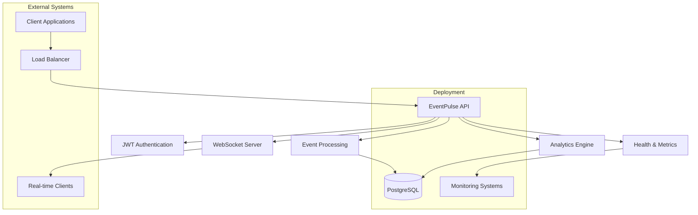
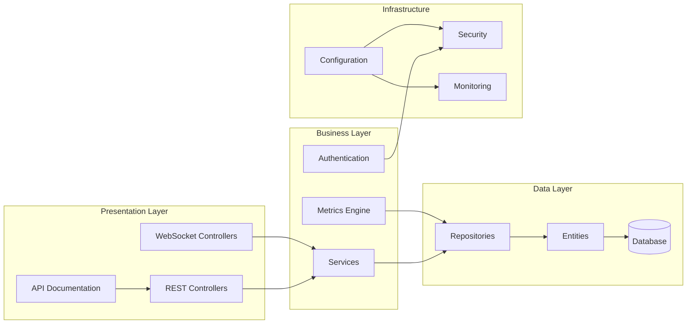

# EventPulse

[](https://github.com/your-org/EventPulse/actions)
[](https://github.com/your-org/EventPulse/pkgs/container/eventpulse)
[](LICENSE)
[](https://openjdk.java.net/projects/jdk/21/)
[](https://spring.io/projects/spring-boot)

> A comprehensive event management and analytics platform built with Spring Boot, featuring real-time event ingestion, processing, and analytics capabilities with JWT authentication, WebSocket support, and detailed metrics.

## 📋 Table of Contents

- [Overview](#overview)
- [Architecture](#architecture)
- [Features](#features)
- [Quick Start](#quick-start)
- [API Documentation](#api-documentation)
- [Configuration](#configuration)
- [Deployment](#deployment)
- [Development](#development)
- [Testing](#testing)
- [Monitoring](#monitoring)
- [Contributing](#contributing)
- [Future Enhancements](#future-enhancements)
- [License](#license)

## 🎯 Overview

EventPulse is a modern event management platform designed to handle high-volume event ingestion, real-time processing, and comprehensive analytics. Built with Spring Boot and leveraging modern technologies, it provides a robust foundation for event-driven architectures.

### Key Capabilities

- **Real-time Event Ingestion** - RESTful API with WebSocket support
- **Comprehensive Analytics** - Event metrics and aggregations
- **Security** - JWT-based authentication and authorization
- **Scalability** - Docker containerization with horizontal scaling support
- **Monitoring** - Built-in observability with Spring Boot Actuator
- **Documentation** - Interactive API documentation with Swagger/OpenAPI

## 🏗️ Architecture

### System Architecture



### Technology Stack

| Component | Technology | Version |
|-----------|------------|---------|
| **Backend** | Spring Boot | 3.2.0 |
| **Java** | OpenJDK | 21 |
| **Database** | PostgreSQL | 15 |
| **Security** | Spring Security + JWT | Latest |
| **Documentation** | SpringDoc OpenAPI | 2.2.0 |
| **Monitoring** | Spring Boot Actuator | Built-in |
| **Container** | Docker | Latest |
| **CI/CD** | GitHub Actions | Latest |

### Component Architecture



## ✨ Features

### Core Features

- **Event Management**
  - Create, read, update, and delete events
  - Bulk event processing
  - Event filtering and search
  - Real-time event streaming via WebSocket

- **Analytics & Metrics**
  - Event count aggregations
  - Time-based analytics
  - Source and type breakdowns
  - Custom metric queries

- **Security**
  - JWT-based authentication
  - Role-based access control
  - Secure API endpoints
  - Token validation and refresh

- **Real-time Features**
  - WebSocket event broadcasting
  - Live event notifications
  - Real-time metrics updates
  - Connection management

### Advanced Features

- **Observability**
  - Health checks and monitoring
  - Performance metrics
  - Request tracing
  - Error tracking

- **Documentation**
  - Interactive API documentation
  - OpenAPI specification
  - Code examples
  - Testing interface

- **DevOps**
  - Docker containerization
  - CI/CD pipeline
  - Automated testing
  - Multi-environment support

## 🚀 Quick Start

### Prerequisites

- **Java 21** or higher
- **Maven 3.6+** or higher
- **PostgreSQL 15** or higher
- **Docker** (optional, for containerized deployment)

### Local Development Setup

1. **Clone the repository**
   ```bash
   git clone https://github.com/your-org/EventPulse.git
   cd EventPulse
   ```

2. **Set up PostgreSQL database**
   ```bash
   # Using Docker
   docker run --name eventpulse-postgres \
     -e POSTGRES_DB=eventpulse \
     -e POSTGRES_USER=eventpulse \
     -e POSTGRES_PASSWORD=eventpulse \
     -p 5432:5432 \
     -d postgres:15-alpine
   ```

3. **Configure application**
   ```bash
   # Copy and modify configuration
   cp src/main/resources/application.yaml src/main/resources/application-local.yaml
   # Update database connection details if needed
   ```

4. **Build and run**
   ```bash
   # Build the application
   mvn clean compile
   
   # Run tests
   mvn test
   
   # Start the application
   mvn spring-boot:run
   ```

5. **Verify installation**
   ```bash
   # Health check
   curl http://localhost:8080/api/health
   
   # API documentation
   open http://localhost:8080/swagger-ui.html
   ```

### Docker Setup

1. **Using Docker Compose (Recommended)**
   ```bash
   # Start all services
   docker-compose up -d
   
   # View logs
   docker-compose logs -f
   
   # Stop services
   docker-compose down
   ```

2. **Using Docker directly**
   ```bash
   # Build image
   docker build -t eventpulse .
   
   # Run container
   docker run -d \
     --name eventpulse \
     -p 8080:8080 \
     -e SPRING_DATASOURCE_URL=jdbc:postgresql://host.docker.internal:5432/eventpulse \
     -e SPRING_DATASOURCE_USERNAME=eventpulse \
     -e SPRING_DATASOURCE_PASSWORD=eventpulse \
     eventpulse
   ```

## 📚 API Documentation

### Authentication

EventPulse uses JWT-based authentication. Obtain a token by authenticating with the login endpoint.

#### Login
```bash
curl -X POST http://localhost:8080/api/auth/login \
  -H "Content-Type: application/json" \
  -d '{
    "username": "admin",
    "password": "password"
  }'
```

**Response:**
```json
{
  "token": "eyJhbGciOiJIUzUxMiJ9...",
  "type": "Bearer",
  "username": "admin",
  "expiresAt": "2023-12-02T10:30:00Z",
  "message": "Authentication successful"
}
```

### Event Management

#### Create Event
```bash
curl -X POST http://localhost:8080/api/events \
  -H "Authorization: Bearer YOUR_JWT_TOKEN" \
  -H "Content-Type: application/json" \
  -d '{
    "source": "user-service",
    "type": "login",
    "message": "User john.doe logged in successfully"
  }'
```

**Response:**
```json
{
  "id": "123e4567-e89b-12d3-a456-426614174000",
  "source": "user-service",
  "type": "login",
  "message": "User john.doe logged in successfully",
  "timestamp": "2023-12-01T10:30:00Z"
}
```

#### Get Events with Filtering
```bash
# Get all events
curl -X GET http://localhost:8080/api/events \
  -H "Authorization: Bearer YOUR_JWT_TOKEN"

# Filter by type
curl -X GET "http://localhost:8080/api/events?type=login" \
  -H "Authorization: Bearer YOUR_JWT_TOKEN"

# Filter by source
curl -X GET "http://localhost:8080/api/events?source=user-service" \
  -H "Authorization: Bearer YOUR_JWT_TOKEN"

# Filter by time range
curl -X GET "http://localhost:8080/api/events?startTime=2023-12-01T00:00:00Z&endTime=2023-12-01T23:59:59Z" \
  -H "Authorization: Bearer YOUR_JWT_TOKEN"

# Combined filters
curl -X GET "http://localhost:8080/api/events?type=login&source=user-service&startTime=2023-12-01T00:00:00Z&endTime=2023-12-01T23:59:59Z" \
  -H "Authorization: Bearer YOUR_JWT_TOKEN"
```

#### Get Event by ID
```bash
curl -X GET http://localhost:8080/api/events/123e4567-e89b-12d3-a456-426614174000 \
  -H "Authorization: Bearer YOUR_JWT_TOKEN"
```

#### Delete Event
```bash
curl -X DELETE http://localhost:8080/api/events/123e4567-e89b-12d3-a456-426614174000 \
  -H "Authorization: Bearer YOUR_JWT_TOKEN"
```

### Metrics and Analytics

#### Get All Metrics
```bash
curl -X GET http://localhost:8080/api/metrics \
  -H "Authorization: Bearer YOUR_JWT_TOKEN"
```

**Response:**
```json
{
  "totalEvents": 1250,
  "eventsByType": [
    {"type": "login", "count": 450},
    {"type": "error", "count": 320},
    {"type": "payment", "count": 280},
    {"type": "logout", "count": 200}
  ],
  "eventsBySource": [
    {"source": "user-service", "count": 650},
    {"source": "payment-service", "count": 400},
    {"source": "auth-service", "count": 200}
  ]
}
```

#### Get Metrics by Time Range
```bash
curl -X GET "http://localhost:8080/api/metrics?startTime=2023-12-01T00:00:00Z&endTime=2023-12-01T23:59:59Z" \
  -H "Authorization: Bearer YOUR_JWT_TOKEN"
```

#### Get Recent Metrics
```bash
curl -X GET "http://localhost:8080/api/metrics/recent?hours=24" \
  -H "Authorization: Bearer YOUR_JWT_TOKEN"
```

#### Get Specific Metrics
```bash
# Total event count
curl -X GET http://localhost:8080/api/metrics/total \
  -H "Authorization: Bearer YOUR_JWT_TOKEN"

# Events by type
curl -X GET http://localhost:8080/api/metrics/type/login \
  -H "Authorization: Bearer YOUR_JWT_TOKEN"

# Events by source
curl -X GET http://localhost:8080/api/metrics/source/user-service \
  -H "Authorization: Bearer YOUR_JWT_TOKEN"
```

### Health and Monitoring

#### Health Check
```bash
curl -X GET http://localhost:8080/api/health
```

#### Application Info
```bash
curl -X GET http://localhost:8080/actuator/info
```

#### Metrics
```bash
curl -X GET http://localhost:8080/actuator/metrics
```

### WebSocket Connection

```javascript
// Connect to WebSocket
const socket = new SockJS('/ws');
const stompClient = Stomp.over(socket);

stompClient.connect({}, function(frame) {
    console.log('Connected: ' + frame);
    
    // Subscribe to event updates
    stompClient.subscribe('/topic/events', function(message) {
        const eventMessage = JSON.parse(message.body);
        console.log('New event:', eventMessage);
    });
});

// Send message
stompClient.send('/app/events', {}, JSON.stringify({
    message: 'Hello from client'
}));
```

## ⚙️ Configuration

### Application Properties

Key configuration options in `application.yaml`:

```yaml
spring:
  application:
    name: eventpulse
  
  datasource:
    url: jdbc:postgresql://localhost:5432/eventpulse
    username: eventpulse
    password: eventpulse
  
  jpa:
    hibernate:
      ddl-auto: update
    show-sql: false

server:
  port: 8080

# JWT Configuration
app:
  jwt:
    secret: your-secret-key-here
    expiration: 86400000 # 24 hours

# OpenAPI Documentation
springdoc:
  api-docs:
    path: /v3/api-docs
  swagger-ui:
    path: /swagger-ui.html

# Monitoring
management:
  endpoints:
    web:
      exposure:
        include: health,info,metrics
```

### Environment Variables

| Variable | Description | Default |
|----------|-------------|---------|
| `SPRING_DATASOURCE_URL` | Database connection URL | `jdbc:postgresql://localhost:5432/eventpulse` |
| `SPRING_DATASOURCE_USERNAME` | Database username | `eventpulse` |
| `SPRING_DATASOURCE_PASSWORD` | Database password | `eventpulse` |
| `APP_JWT_SECRET` | JWT signing secret | Generated |
| `APP_JWT_EXPIRATION` | Token expiration (ms) | `86400000` |
| `SERVER_PORT` | Application port | `8080` |

### Database Configuration

#### PostgreSQL Setup
```sql
-- Create database
CREATE DATABASE eventpulse;

-- Create user
CREATE USER eventpulse WITH PASSWORD 'eventpulse';

-- Grant privileges
GRANT ALL PRIVILEGES ON DATABASE eventpulse TO eventpulse;
```

#### Connection Pool Settings
```yaml
spring:
  datasource:
    hikari:
      maximum-pool-size: 10
      minimum-idle: 2
      connection-timeout: 30000
      idle-timeout: 600000
      max-lifetime: 1800000
```

## 🚀 Deployment

### Docker Deployment

#### Production Docker Compose
```yaml
version: '3.8'
services:
  postgres:
    image: postgres:15-alpine
    environment:
      POSTGRES_DB: eventpulse
      POSTGRES_USER: eventpulse
      POSTGRES_PASSWORD: ${DB_PASSWORD}
    volumes:
      - postgres_data:/var/lib/postgresql/data
    ports:
      - "5432:5432"

  eventpulse:
    image: ghcr.io/your-org/eventpulse:latest
    environment:
      SPRING_DATASOURCE_URL: jdbc:postgresql://postgres:5432/eventpulse
      SPRING_DATASOURCE_USERNAME: eventpulse
      SPRING_DATASOURCE_PASSWORD: ${DB_PASSWORD}
      APP_JWT_SECRET: ${JWT_SECRET}
    ports:
      - "8080:8080"
    depends_on:
      - postgres

volumes:
  postgres_data:
```

#### Kubernetes Deployment
```yaml
apiVersion: apps/v1
kind: Deployment
metadata:
  name: eventpulse
spec:
  replicas: 3
  selector:
    matchLabels:
      app: eventpulse
  template:
    metadata:
      labels:
        app: eventpulse
    spec:
      containers:
      - name: eventpulse
        image: ghcr.io/your-org/eventpulse:latest
        ports:
        - containerPort: 8080
        env:
        - name: SPRING_DATASOURCE_URL
          value: "jdbc:postgresql://postgres:5432/eventpulse"
        - name: SPRING_DATASOURCE_USERNAME
          value: "eventpulse"
        - name: SPRING_DATASOURCE_PASSWORD
          valueFrom:
            secretKeyRef:
              name: eventpulse-secrets
              key: db-password
        livenessProbe:
          httpGet:
            path: /api/health
            port: 8080
          initialDelaySeconds: 60
          periodSeconds: 30
        readinessProbe:
          httpGet:
            path: /api/health
            port: 8080
          initialDelaySeconds: 30
          periodSeconds: 10
```

### CI/CD Pipeline

The project includes a comprehensive GitHub Actions CI/CD pipeline:

- **Automated Testing** - Unit and integration tests
- **Code Quality** - SpotBugs, Checkstyle, OWASP dependency check
- **Security Scanning** - Vulnerability assessment
- **Docker Build** - Multi-platform container images
- **Deployment** - Automated staging and production deployments

See [CI/CD Documentation](CICD_README.md) for detailed information.

## 🛠️ Development

### Project Structure

```
EventPulse/
├── src/
│   ├── main/
│   │   ├── java/com/eventpulse/
│   │   │   ├── config/          # Configuration classes
│   │   │   ├── controller/      # REST controllers
│   │   │   ├── dto/            # Data transfer objects
│   │   │   ├── entity/         # JPA entities
│   │   │   ├── exception/      # Exception handlers
│   │   │   ├── repository/     # Data repositories
│   │   │   ├── security/       # Security configuration
│   │   │   └── service/        # Business logic
│   │   └── resources/
│   │       ├── application.yaml
│   │       └── static/         # Static resources
│   └── test/                   # Test classes
├── design/
│   └── openapi.yaml           # OpenAPI specification
├── docker/                    # Docker configuration
├── .github/
│   └── workflows/            # GitHub Actions
├── Dockerfile
├── docker-compose.yaml
└── pom.xml
```

### Development Setup

1. **IDE Configuration**
   - Install Java 21
   - Configure Maven settings
   - Install Lombok plugin
   - Configure code style (Google Java Style)

2. **Database Setup**
   ```bash
   # Start PostgreSQL
   docker-compose up -d postgres
   
   # Verify connection
   psql -h localhost -U eventpulse -d eventpulse
   ```

3. **Running Tests**
   ```bash
   # All tests
   mvn test
   
   # Unit tests only
   mvn test -Dtest="*Test"
   
   # Integration tests only
   mvn test -Dtest="*IntegrationTest"
   
   # With coverage
   mvn clean test jacoco:report
   ```

4. **Code Quality Checks**
   ```bash
   # Checkstyle
   mvn checkstyle:check
   
   # SpotBugs
   mvn spotbugs:check
   
   # OWASP dependency check
   mvn org.owasp:dependency-check-maven:check
   ```

### Adding New Features

1. **Create Feature Branch**
   ```bash
   git checkout -b feature/new-feature
   ```

2. **Implement Changes**
   - Add tests first (TDD approach)
   - Implement business logic
   - Add API documentation
   - Update configuration if needed

3. **Test Changes**
   ```bash
   mvn clean test
   mvn checkstyle:check
   mvn spotbugs:check
   ```

4. **Create Pull Request**
   - Use the provided PR template
   - Ensure all checks pass
   - Request code review

## 🧪 Testing

### Test Strategy

- **Unit Tests** - Service layer and utility classes
- **Integration Tests** - Controller layer with MockMvc
- **Repository Tests** - Database integration
- **Security Tests** - Authentication and authorization
- **Contract Tests** - API contracts and OpenAPI spec

### Running Tests

```bash
# All tests
mvn clean test

# Specific test class
mvn test -Dtest=EventServiceTest

# Tests with coverage
mvn clean test jacoco:report

# Integration tests
mvn verify -DskipUnitTests
```

### Test Coverage

The project maintains a minimum of 60% code coverage. Coverage reports are generated using JaCoCo and are available at:
- **Local**: `target/site/jacoco/index.html`
- **CI/CD**: GitHub Actions artifacts

### Test Data

Test data is managed through:
- **Test fixtures** - Static test data
- **Test builders** - Dynamic test data generation
- **Test containers** - Isolated database instances

## 📊 Monitoring

### Health Checks

EventPulse provides comprehensive health monitoring:

```bash
# Basic health check
curl http://localhost:8080/api/health

# Detailed health information
curl http://localhost:8080/actuator/health

# Application metrics
curl http://localhost:8080/actuator/metrics
```

### Monitoring Endpoints

| Endpoint | Description | Access |
|----------|-------------|---------|
| `/api/health` | Basic health status | Public |
| `/actuator/health` | Detailed health info | Public |
| `/actuator/metrics` | Application metrics | Public |
| `/actuator/info` | Application information | Public |
| `/actuator/env` | Environment properties | Protected |

### Logging

Logging is configured with appropriate levels:

```yaml
logging:
  level:
    com.eventpulse: INFO
    org.springframework.web: INFO
    org.springframework.security: WARN
    org.hibernate.SQL: WARN
```

### Metrics

Custom metrics are exposed for:
- **Event counts** - Total events, events by type/source
- **API performance** - Response times, request counts
- **Database performance** - Query times, connection pool stats
- **JVM metrics** - Memory usage, GC statistics

## 🤝 Contributing

We welcome contributions! Please follow these guidelines:

### Development Process

1. **Fork the repository**
2. **Create a feature branch**
3. **Make your changes**
4. **Add tests** for new functionality
5. **Ensure all tests pass**
6. **Update documentation**
7. **Create a pull request**

### Code Standards

- **Java Code Style**: Google Java Style Guide
- **Test Coverage**: Minimum 60%
- **Documentation**: JavaDoc for public APIs
- **Security**: No hardcoded secrets or credentials

### Pull Request Process

1. **Use the PR template**
2. **Ensure CI/CD checks pass**
3. **Request code review**
4. **Address feedback**
5. **Merge after approval**

See [CONTRIBUTING.md](CONTRIBUTING.md) for detailed guidelines.

## 🔮 Future Enhancements

### Planned Features

#### Phase 1 - Enhanced Analytics
- **Advanced Metrics** - Custom metric definitions
- **Dashboard** - Real-time analytics dashboard
- **Alerting** - Configurable alerts and notifications
- **Data Export** - CSV/JSON export functionality

#### Phase 2 - Scalability
- **Event Streaming** - Apache Kafka integration
- **Caching** - Redis-based caching layer
- **Load Balancing** - Multi-instance deployment
- **Auto-scaling** - Kubernetes HPA support

#### Phase 3 - Advanced Features
- **Event Correlation** - Pattern detection and analysis
- **Machine Learning** - Anomaly detection
- **Multi-tenancy** - Tenant isolation and management
- **API Rate Limiting** - Request throttling and quotas

#### Phase 4 - Enterprise Features
- **Audit Logging** - Comprehensive audit trails
- **Backup & Recovery** - Automated backup strategies
- **Disaster Recovery** - Multi-region deployment
- **Compliance** - GDPR, SOC2 compliance features

### Technology Roadmap

| Phase | Timeline | Technologies |
|-------|----------|--------------|
| **Phase 1** | Q1 2024 | Enhanced Spring Boot, React Dashboard |
| **Phase 2** | Q2 2024 | Apache Kafka, Redis, Kubernetes |
| **Phase 3** | Q3 2024 | Apache Flink, TensorFlow, Multi-tenancy |
| **Phase 4** | Q4 2024 | Enterprise security, Compliance tools |

### Community Contributions

We encourage community contributions for:
- **Bug fixes** - Issues and improvements
- **New features** - Feature requests and implementations
- **Documentation** - Guides and tutorials
- **Testing** - Additional test coverage
- **Performance** - Optimization and benchmarking

### Getting Involved

- **GitHub Issues** - Report bugs and request features
- **Discussions** - Join community discussions
- **Pull Requests** - Contribute code changes
- **Documentation** - Improve guides and examples

## 📄 License

This project is licensed under the MIT License - see the [LICENSE](LICENSE) file for details.

## 🙏 Acknowledgments

- **Spring Boot** - Application framework
- **PostgreSQL** - Database system
- **Docker** - Containerization platform
- **GitHub Actions** - CI/CD platform
- **OpenAPI** - API documentation standard

## 📞 Support

### Getting Help

- **Documentation** - Check this README and related docs
- **Issues** - Create GitHub issues for bugs and features
- **Discussions** - Use GitHub Discussions for questions
- **Email** - Contact the maintainers directly

### Resources

- [API Documentation](http://localhost:8080/swagger-ui.html)
- [Docker Guide](DOCKER_README.md)
- [CI/CD Guide](CICD_README.md)
- [Observability Guide](OBSERVABILITY_README.md)
- [Development Guide](DEVELOPMENT.md)

---

**EventPulse** - Empowering event-driven architectures with modern technology and comprehensive analytics.

[⬆ Back to Top](#eventpulse)
