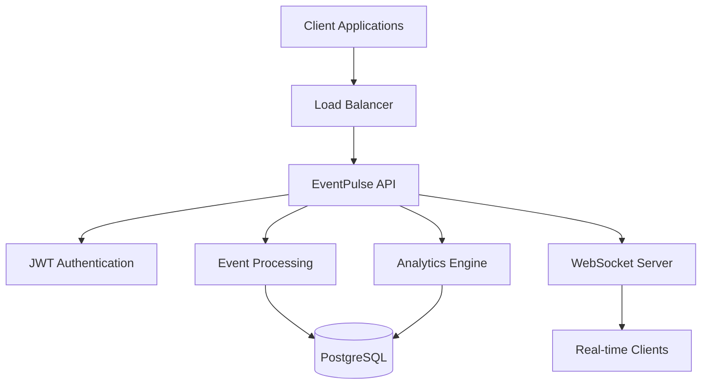

# Prompt 12 — Final Polish

> Write a professional README.md including:
> - Overview  
> - Architecture  
> - Setup instructions  
> - Example API calls  
> - Future enhancements  
>
> Save all previous prompts in `/prompts` folder as markdown files.

## Implementation Summary

This final prompt completed the EventPulse project by creating comprehensive documentation and organizing all development prompts for future reference:

### Files Created:
- `README.md` - Professional project documentation
- `prompts/` folder with 12 prompt documentation files
- Complete project overview and architecture documentation

### Key Features Implemented:

#### Professional README.md:
- **Project Overview** - Comprehensive introduction to EventPulse
- **Architecture Diagrams** - Mermaid diagrams for system and component architecture
- **Technology Stack** - Complete technology overview with versions
- **Quick Start Guide** - Step-by-step setup instructions
- **API Documentation** - Comprehensive API examples with curl commands
- **Configuration Guide** - Environment variables and database setup
- **Deployment Instructions** - Docker, Kubernetes, and CI/CD deployment
- **Development Guide** - Local development setup and best practices
- **Testing Documentation** - Test strategy and execution instructions
- **Monitoring Guide** - Health checks and observability features
- **Contributing Guidelines** - Development process and code standards
- **Future Enhancements** - Roadmap and planned features

#### Architecture Documentation:
- **System Architecture** - High-level system design with Mermaid diagrams
- **Component Architecture** - Detailed component relationships
- **Technology Stack Table** - Comprehensive technology overview
- **Deployment Architecture** - Container and orchestration details

#### Setup Instructions:
- **Prerequisites** - Required software and versions
- **Local Development** - Step-by-step local setup
- **Docker Setup** - Containerized development and deployment
- **Database Configuration** - PostgreSQL setup and configuration
- **Environment Configuration** - Application properties and variables

#### API Examples:
- **Authentication** - JWT login and token usage
- **Event Management** - CRUD operations with filtering
- **Metrics and Analytics** - Comprehensive analytics examples
- **Health and Monitoring** - Health check and monitoring endpoints
- **WebSocket Connection** - Real-time event streaming

#### Future Enhancements:
- **Phase 1** - Enhanced analytics and dashboard
- **Phase 2** - Scalability with Kafka and Redis
- **Phase 3** - Advanced features with ML and multi-tenancy
- **Phase 4** - Enterprise features and compliance

### Technical Implementation:

#### README Structure:
```markdown
# EventPulse

## 📋 Table of Contents
- Overview
- Architecture
- Features
- Quick Start
- API Documentation
- Configuration
- Deployment
- Development
- Testing
- Monitoring
- Contributing
- Future Enhancements
- License
```

#### Architecture Diagrams:


#### API Examples:
```bash
# Authentication
curl -X POST http://localhost:8080/api/auth/login \
  -H "Content-Type: application/json" \
  -d '{"username":"admin","password":"password"}'

# Create Event
curl -X POST http://localhost:8080/api/events \
  -H "Authorization: Bearer YOUR_JWT_TOKEN" \
  -H "Content-Type: application/json" \
  -d '{"source":"user-service","type":"login","message":"User logged in"}'

# Get Metrics
curl -X GET http://localhost:8080/api/metrics \
  -H "Authorization: Bearer YOUR_JWT_TOKEN"
```

### Prompt Documentation:

#### Organized Prompt History:
- **01-project-initialization.md** - Spring Boot project setup
- **02-domain-models.md** - JPA entities and repositories
- **03-service-layer.md** - Business logic implementation
- **04-rest-controller.md** - REST API endpoints
- **05-metrics-aggregation.md** - Analytics and metrics
- **06-websocket-support.md** - Real-time features
- **07-jwt-security.md** - Authentication and authorization
- **08-testing.md** - Comprehensive testing suite
- **09-docker-deployment.md** - Containerization
- **10-observability-documentation.md** - Monitoring and docs
- **11-github-actions-cicd.md** - CI/CD pipeline
- **12-final-polish.md** - Final documentation

#### Each Prompt Includes:
- **Implementation Summary** - What was built and why
- **Files Created** - Complete file listing
- **Key Features** - Detailed feature descriptions
- **Technical Implementation** - Code examples and configurations
- **Usage Examples** - How to use the implemented features

### Documentation Features:

#### Comprehensive Coverage:
- **Getting Started** - Quick setup for new developers
- **Architecture Understanding** - System design and components
- **API Reference** - Complete API documentation with examples
- **Deployment Guide** - Production deployment instructions
- **Development Workflow** - Local development best practices
- **Testing Strategy** - Comprehensive testing approach
- **Monitoring Setup** - Observability and health monitoring
- **Contributing Process** - How to contribute to the project

#### Professional Presentation:
- **Badges** - CI/CD status, Docker image, license, Java version
- **Table of Contents** - Easy navigation
- **Code Examples** - Real-world usage patterns
- **Diagrams** - Visual architecture representation
- **Structured Format** - Consistent documentation style

#### Future-Proof Design:
- **Roadmap** - Planned enhancements and features
- **Technology Evolution** - Upgrade paths and considerations
- **Community Guidelines** - Contribution and support processes
- **Resource Links** - External documentation and references

### Benefits:

#### For New Developers:
- **Quick Onboarding** - Clear setup instructions
- **Architecture Understanding** - Visual system design
- **API Learning** - Comprehensive examples
- **Best Practices** - Development guidelines

#### For Operations:
- **Deployment Guide** - Production deployment instructions
- **Monitoring Setup** - Health checks and observability
- **Configuration Reference** - Environment and database setup
- **Troubleshooting** - Common issues and solutions

#### For Project Management:
- **Feature Overview** - Complete feature documentation
- **Roadmap Planning** - Future enhancement roadmap
- **Quality Assurance** - Testing and quality guidelines
- **Community Building** - Contributing and support processes

This final polish completed the EventPulse project with professional documentation, comprehensive API examples, and organized development history, providing a complete foundation for future development and community engagement.
